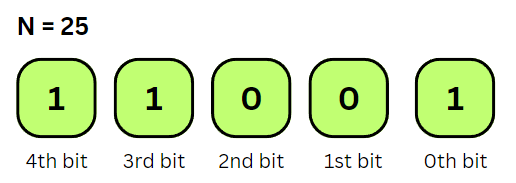

## Topics

1. [Binary Representation](#bin)
2. [Shift Operators (<<, >>)](#shift)
3. [Bitwise Operators (|, &, ^, ~)](#operators)
4. [Bit Mask](#mask)
5. [Bit Manipulation Problems](#problems)

## 1. Binary Representation

- Use 1s and 0s to represent integers
  - example: 10 (decimal) is 1010 (binary)
- Signed vs Unsigned integers
  - Signed
    - Signed integers can **represent both positive and negative numbers, including zero.**
    - The **leftmost bit (most significant bit) is reserved for the sign**, where **0 indicates a positive number** and **1 indicates a negative number** (using **two's complement representation**).
    - **Range: from -128 to 127**.
    - Representation: 0 for positive numbers and 1 for negative numbers.
    - For example, in a signed 8-bit integer:
      - Decimal: -42
      - Binary (8 bits): 11010110
  - Unsigned
    - Unsigned integers **can only represent non-negative numbers**, **including zero.**
    - **All bits** are **used to represent the magnitude of the number**.
    - **Range: from 0 to 255**.
    - Representation: No sign bit; all bits are used to represent the magnitude.
    - For example, in an unsigned 8-bit integer:
      - Decimal: 214
      - Binary (8 bits): 11010110
- How to represent -ve numbers (signed integers)?
  - In form of its Two's complement

**How to get Two's Complement**
- Example:
    - Binary for -42 is two's complememnt of 42
    - So complement 42 which results in negative value (~42=-43), then add 1 to it (-43+1=-42)

## 2. Shift Operators (<<, >>)
- Shifting Integers
    - Logical Shifting
        - Relation with Division and Multiplication by 2
    - Arithmetic Shifting
        - Preserves the sign in a signed integer during shifting

#### 1. Logical Shift
- A **Left Logical Shift** of one position moves **each bit to the left by one**. The vacant least significant bit (**LSB) is filled with zero** and the most significant bit (MSB) is discarded.
- A **Right Logical Shift** of one position moves **each bit to the right by one**. The least significant bit is discarded and the vacant **MSB is filled with zero**.

#### 2. Arithmetic Shift
- A **Left Arithmetic Shift** of one position moves each bit to the left by one. The vacant least significant bit (LSB) is filled with zero and the most significant bit (MSB) is discarded. It is **identical to Left Logical Shift**.
- A **Right Arithmetic Shift** of one position **moves each bit to the right by one**. The least significant bit is discarded and the vacant **MSB is filled with the value of the previous (now shifted one position to the right) MSB**.

***Basic Logic of shifting:*** 
- *Based on multiplicatinon(right shift) and division(left shift) by 2*
- *In case of arthmetic right shift, it is multiplication of two's complements resulting in negative number to another negative number, thus preserving the sign*
- *eg: If we have the binary number 1010 (-6 decimal) and we perform arithmetic right shift by 1 bit we get the binary number 1101 (-3 decimal). So we have divided the original negative number by 2.*

## 3. Bitwise Operators (|, &, ^, ~)
- Operators
    - OR (|)
    - AND (&)
    - XOR (^) 
    - Complement (~)

#### 1. AND (&):
- Sets each bit to 1 if both bits are 1.
- Example: 
    - 5 & 3 = 1
    - 0101 & 0011 = 0001

#### 2. OR (|):
- Sets each bit to 1 if at least one of the corresponding bits is 1.
- Example: 
    - 5 | 3 = 7
    - 0101 | 0011 = 0111

#### 3. XOR (^):
- Sets each bit to 1 if only one of the corresponding bits is 1.
- Example: 
    - 5 ^ 3 = 6
    - 0101 ^ 0011 = 0110

#### 4. NOT (~):
- Flips each bit. and changes the sign
- Example: 
    - ~5 = -6
    - ~0101 = 1010 (two's complement of 6(0110))
    - (*to calculate two's complement decimal form from binary form, subtract existing value by 1 (eg: 1010=10, 10-1=9 => 1001). Then invert the bits (~1001=0110 => 6). Since the initial binary was a two's complement, the final answer would be an unsigned integer -6*)

## 4. Bit Mask
Masks (particular combination of bits) can be created and used in conjunction with the Bitwise Operators to: 
- Set a particular bit
- Get a particular bit
- Clear a particular bit 

1. To Set a bit
- Create a mask for the position at which the bit has to be set
- for example 
    
    - In case of a binary number 11001, suppose I want to set a bit at position 2
    - First create a mask of 1 left shifted to 2 times. I.e, **0001 << 2 = 0100**
    - Then OR the mask with the original number. I.e, **0100 | 11001 = 11101 (final answer)**

1. To Get a bit
- Create a mask for the position at which the bit has to be checked/get
- For example 
    
    - In case of a binary number 11001, suppose I want to get a bit at position 3
    - First create a mask of 1 left shifted to 3 times. I.e, **00001 << 3 = 01000**
    - Then AND the mask with the original number. I.e, **01000 & 11001 =01000**
    - If the **resulting answer is greater than 0**, then that **bit is set**, 
    - Else **if the answer is 0**, then the **bit not set**

## 5. Bit Manipulation Problems
***Tip:***
*Writing smaller methods like FlipBit(), IsBitSet(), SetBit(), GetBit() are very useful to have while solving problems.*

- Crio
    1. Swap Two Numbers
    2. Find the Duplicate Number
    3. Swap the Odd and Even bits of an integer
    4. Reverse the bits of a given integer
    5. Two non repeating numbers
- chatgpt
    1. **Single Number**:
        - Given a non-empty array of integers nums, every element appears twice except for one. Find that single one.
    2. **Number of 1 Bits**:
        - Write a function that takes an unsigned integer and returns the number of '1' bits it has (also known as the Hamming weight).
    3. **Reverse Bits**:
        - Reverse bits of a given 32 bits unsigned integer.
    4. **Power of Two**:
        - Given an integer n, write a function to determine if it is a power of two.
    5. **Counting Bits**:
        - Given a non-negative integer num, for every number i in the range 0 ≤ i ≤ num, calculate the number of 1's in their binary representation and return them as an array.
    6. **Bitwise AND of Numbers Range**:
        - Given two integers left and right that represent the range [left, right], return the bitwise AND of all numbers in this range, inclusive.
    7. **Bitwise ORs of Subarrays**:
        - We have an array arr of non-negative integers. For every (contiguous) subarray sub = [arr[i], arr[i + 1], ..., arr[j]] (with i <= j), we take the bitwise OR of all the elements in sub, obtaining OR(sub). Return the number of possible results.
    8. **Maximum XOR of Two Numbers in an Array**:
        - Given an integer array nums, return the maximum result of nums[i] XOR nums[j], where 0 ≤ i ≤ j < n.
    9. **Bitwise AND of Numbers Range**:
        - Given two integers left and right that represent the range [left, right], return the bitwise AND of all numbers in this range, inclusive.
    10. **Next Greater Element III**:
        - Given a positive integer n, find the smallest integer which has exactly the same digits existing in the integer n and is greater in value than n. If no such positive integer exists, return -1.
