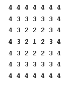

We can see:

- Size: 7 × 7
- Outer layer: 4s
- Next inner layer: 3s
- Then 2s, then 1 at the center
- The number at each cell is determined by the **minimum** distance to any border, subtracted from the outermost number.
  
- dist 1 and dist 2 are 2 distances of 3 from the border. and min among them in dist 1. and all 3s are far from the border by dist 1 (**min** distance to any border)
- so we are going to loop across each cell in the matrix and for each cell calculate how far is that cell from its closest border. and that value is written there
