### Overview

- [Striver's A2Z sheet](https://takeuforward.org/strivers-a2z-dsa-course/strivers-a2z-dsa-course-sheet-2/)
- Coding in cpp:
  - To run code install coderunner and press `ctrl+alt+N`
  - Set `"terminal.integrated.defaultProfile.windows": "Command Prompt"` in settings.json in vscode

### Coding practise steps:

- code yourself
  - First code by yourself + calculate complexities
  - find logic with better complexity
  - find other possible ways in which the same question can be solved
- verify
  - check if your answers include the provided solution. if no, understand the soltuion
  - find different ways of solving from gpt
  - discuss the best few ways of solving with gpt
    > document everything for that question. maintain a practise sheet per question

### Table of content

1. [Cpp Basics](./01-basics/readme.md)
2. [Patterns](./02-patterns/)
   - <table>
   <tr>
   <td></td>
   <td></td>
   <td><a href='./02-patterns/03/readme.md'>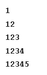</a></td>
   <td><a href='./02-patterns/04/readme.md'>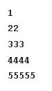</a></td>
   <td></td>
   <td><a href='./02-patterns/06/readme.md'>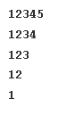</a></td>
   <td></td>
   <td></td>
   <td></td>
   <td></td>
   <td><a href='./02-patterns/11/readme.md'>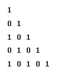</a></td>
   </tr>
   <tr>
   <td><a href='./02-patterns/12/readme.md'>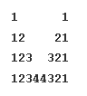</a></td>
   <td><a href='./02-patterns/13/readme.md'>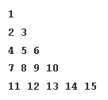</a></td>
   <td><a href='./02-patterns/14/readme.md'>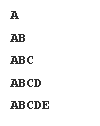</a></td>
   <td><a href='./02-patterns/15/readme.md'>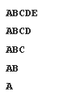</a></td>
   <td><a href='./02-patterns/16/readme.md'>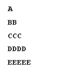</a></td>
   <td><a href='./02-patterns/17/readme.md'>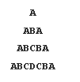</a></td>
   <td><a href='./02-patterns/18/readme.md'>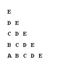</a></td>
   <td></td>
   <td><a href='./02-patterns/20/readme.md'>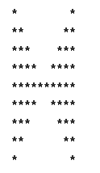</a></td>
   <td></td>
   <td><a href='./02-patterns/22/readme.md'>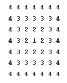</a></td>
   </tr>
   </table>
